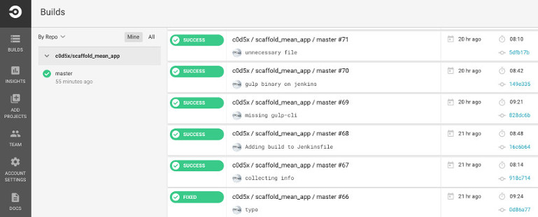
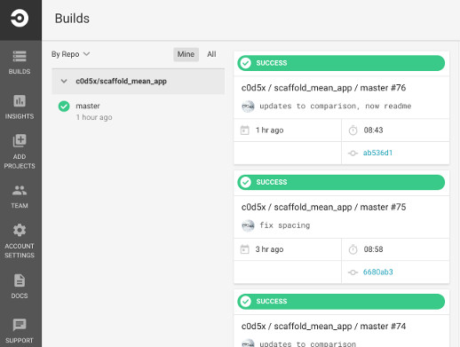
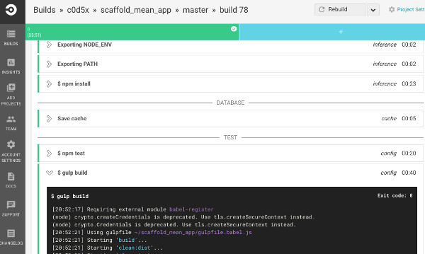
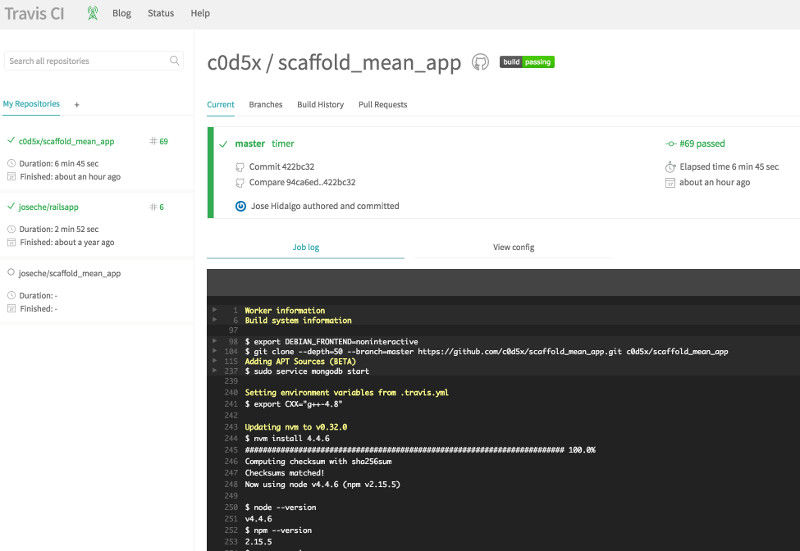
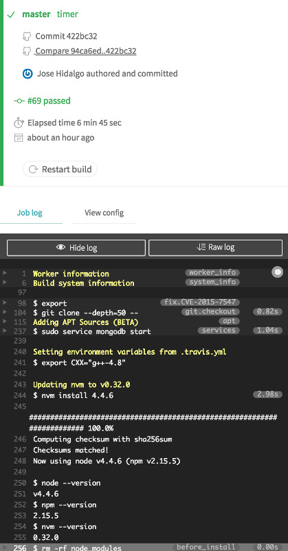
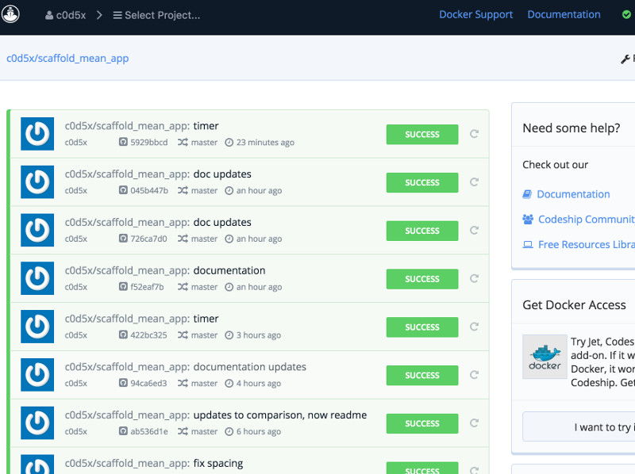
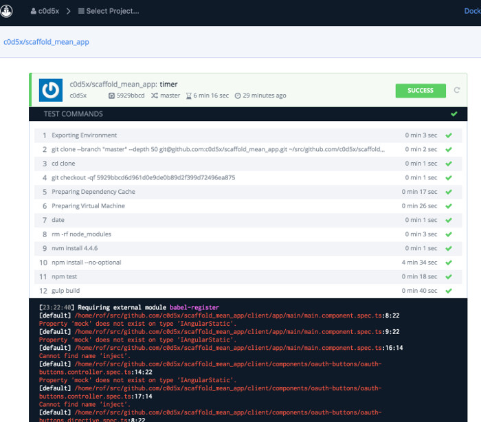
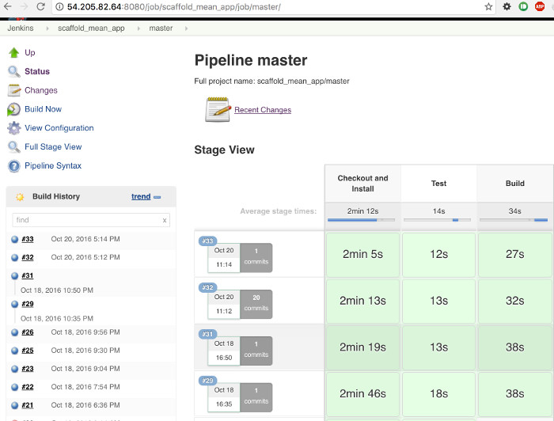
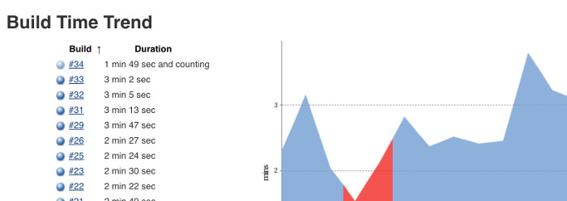
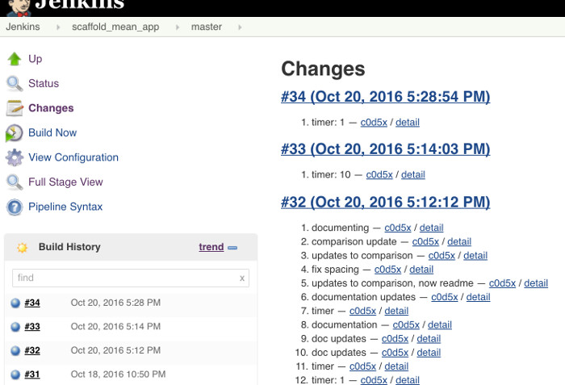

# CircleCI vs TravisCI vs CodeShip vs Jenkins

## Abstract
The idea for this document is to help you decide which of these four Continuous Integration systems to use depending on
your priorities, using an [scaffold application](https://github.com/c0d5x/scaffold_mean_app/) created with [a
generator](https://github.com/DaftMonk/generator-angular-fullstack). The application uses `nodejs 4.4.6`, `npm`, `gulp`
and connects to `mongod`. This document does not cover the delivery process.

## Summary
Continuous Integration and Unit Testing are two critical processes in the development life cycle of every software
project, so the question is not if it should be done, but how it should be done. Luckily there are plenty of options
available for free(for open source projects). This comparison shows how easy/hard it was to make each option work, and
what considerations you should have when you deploy a similar application.

## Evaluation Method
The following aspects are evaluated on each system:

1. **Initial Setup**: Complexity for creating the project and running basic tests
2. **Services**: Complexity for connecting services, mongod in this case
3. **Performance**: Considered as time it takes to run the operations
4. **UI/UX**: Satisfaction in the opinion of the author
5. **Pricing** (although evaluation used free offerings only)

Each system is going to be configured so that builds are triggered when changes are committed, then performance and UI/UX is evaluated. Ten iterations will be considered to get the average performance without changing the code.

## Results Table

|System|Initial Setup|Services|Performance|UI/UX|Pricing|
|:----:|:----:|:----:|:----:|:----:|:----:|
|**TravisCI**|8|10|6:44|**10**|$129/m for 2 concurrent builds, $249/m for 5 concurrent builds, $489/m for 10 concurrent builds|
|**CircleCI**|**10**|10|8:56|8|$150/m for 4 containers, $350/m for 8 containers|
|**CodeShip**|7|8|**6:31**|7.5|$49/m for 1 concurrent build, 2 test pipelines. $99/m for 2 concurrent builds, 2 test pipelines. $199/m for 3 concurrent builds, 3 test pipelines|
|**Jenkins**|7|7|**2:44**|7|**$37/m for a `t2.medium` AWS Instance**|

* `Gitlab` was initially considered but this comparison but it was removed due to the complexity to configure additional services like DB.
* `AWS CodePipeline` is not included in this evaluation because it is not a CI tool but more a CD framework.

## Interpretation of Results
There is clear winner in terms of performance due to the fact that all hosted solutions offer containers. The difference is significant considering the price is much lower than the hosted solutions, this is at the cost of course of some dedication to configure the service and maintain it internally.

CircleCI is a very good option if you are not concerned about performance, but it is clear that they tax more their servers with more containers per CPU. Besides that it offer great UI and availability of services. 

My personal best (excluding Jenkins) is TravisCI, because it provides a very useful UI, availability of services but also it is very well documented and used. Also you can have any number of tests, configured and only pay for 2 concurrent.

**Conclusion**
If you have internal resources that can setup and maintain it, go with Jenkins. If not check TravisCI first, and then CircleCI second.

## Test Program
These operations are considered as standard to build a MEAN application:

### Preparation
1. rm -rf node_modules
2. npm install --no-optional

### Unit Testing
1. npm test

### Build
1. gulp build

Some systems require additional operations like installing underlying software, that time is considered as part of their performance evaluation.

## CircleCI

### Initial Setup
Sign up requires only to authorize CircleCI against Github, then it shows you the list of repositories so you can create the project with a click. The system looks for a file called [circle.yml](https://github.com/c0d5x/scaffold_mean_app/blob/master/circle.yml) to determine what steps conform the build. The [documentation](https://circleci.com/docs/configuration/) is very helpful, providing many examples for the most common languages and features. Setting the node version only requires a statement.
**Rating: 10**

### Services
CircleCI provides many services out of the box, bounded to localhost, the list includes `Postgres, MySQL, MongoDB, Cassandra, redis, elasticsearch, rabbit-mq`, etc, so for this application nothing is required.
**Rating: 10**

### Performance

| Iteration | 1 | 2 | 3 | 4 | 5 | 6 | 7 | 8 | 9 | 10 | Average |
|---------|:-:|:-:|:-:|:-:|:-:|:-:|:-:|:-:|:-:|:-:|------:|
| |9:19|8:48|8:18|8:50|9:17|9:32|9:02|8:58|8:15|9:06|**8:56**|

### UI/UX

#### Main Window
The main page is informative, showing a list of the latest builds with the commit message, time ago and time it took.
 

This page is responsive but in my opinion it doesn't adapt well enough when the width is reduced because the repository list is kept at the same width occupying empty space below the repo name.

#### Build Window
Each command is captured in a panel that is collapsed once the command has completed. Scrolling to the bottom of the page will keep it autoscrolling.

#### ANSI Support
CircleCI correctly supports ANSI codes for different colors.

#### Mobile
The same responsive view is shown on mobile devices, which doesn't use space appropriately.

**UI/UX Rating: 8**

#### Pricing
1. Free for 1 job, 1 container
2. $150/m for 4 containers
3. $350/m for 8 containers

## Travis CI

### Initial Setup
The first thing to learn about TravisCI is that there are two sites: [Travis-CI.com](https://travis-ci.com/) for enterprise clients and [Travis-CI.org](https://travis-ci.org/) for open source projects. Next a big delay was to find out that Travis comes with a really old C++ compiler that doesn't support [C++11](https://en.wikipedia.org/wiki/C%2B%2B11). This is important because `nodejs` and many other languages compile libraries/gems using C++, so you will get strange errors that don't seem to relate to your code. Considering that, you will add a file called [.travis.yml](https://github.com/c0d5x/scaffold_mean_app/blob/master/.travis.yml) to your repo and Travis will start triggering builds when code is commited to Github. There is [good documentation](https://docs.travis-ci.com/) and community base.
**Rating: 7**

### Services
Services in Travis work similar to CircleCI with the exception that in Travis these are not started by default, so you need to specify which services you want load from this list: `MySQL, Postgres, MariaDB, MongoDB, CouchDB, RabbitMQ, memcached, Redis, Cassandra, Neo4j, ElasticSearch, RethinkDB`, etc, and for each of these Travis support a number of versions.
**Rating: 10**

### Performance

The time shown here includes installing a new compiler as noted above.

| Iteration | 1 | 2 | 3 | 4 | 5 | 6 | 7 | 8 | 9 | 10 | Average |
|---------|:-:|:-:|:-:|:-:|:-:|:-:|:-:|:-:|:-:|:-:|------:|
| |6:33|7:05|7:05|6:53|6:15|6:29|6:44|6:49|6:47|6:44|**6:44**|

### UI/UX

#### Main Page
The main page shows the latest build which is very useful. As CircleCI it shows time ago, commit message and commit id, but also a link to compare the last changes which is very useful too.

The same view adapts correctly when reduced in width:

It has autoscrolling and refreshes nicely.

#### ANSI Support
Travis CI does support ANSI codes.

#### Mobile
The responsive view adapts correctly on mobile devices.

**UI/UX Rating: 10**

### Pricing
1. Free for open source projects
2. $129/m for 2 concurrent builds
3. $249/m for 5 concurrent builds
4. $489/m for 10 concurrent builds

## Code Ship

### Initial Setup
To start a project you need to authorize CodeShip against Github and then manually write the repository URI, which is very disapointing. Also you have to write the commands required to build your project in their interface. This is a huge disadvange because your code will be detached with the build steps, so if you need to change the nodejs version, or add one step you have to do it on CodeShip's interface and not your repository's code.
**Rating: 7**

### Services
CodeShip does provide `Cassandra, MongoDB, MySQL, Postgres, RethinkDB, ElasticSearch, Memcached, RabbitMQ, Redis`. Some of this require setup, other like Mongo don't require any configuration.
**Rating: 8**

### Performance

| Iteration | 1 | 2 | 3 | 4 | 5 | 6 | 7 | 8 | 9 | 10 | Average |
|---------|:-:|:-:|:-:|:-:|:-:|:-:|:-:|:-:|:-:|:-:|------:|
| |6:17|6:18|6:08|6:13|6:39|6:31|7:51|6:46|6:13|6:19|**6:31**|

### UI/UX

#### Main Window

The project has to be selected from the top of the page, and then you see a list of the latest builds. It shows time ago, commit id and commit message. 

#### Build Window

CodeShip collapses the output of the build by commands similar to how CircleCI does it. 

**UI/UX Rating: 7.5**

### Pricing
1. Free for 1 concurrent build
2. $49/m for 1 concurrent build, 2 test pipelines
3. $99/m for 2 concurrent builds, 2 test pipelines
4. $199/m for 3 concurrent builds, 3 test pipelines

## Jenkins

### Initial Setup

Starting from scratch with Jenkins may be the worst option for a development group without sysadmin experience, but at the same time it can be totally viable and desirable option for a group with sysadmin experience due to the hability to customice the service, integrate it with slack or other services, and get better performance over the hosted offerings. It is worth to mention that Jenkins 2.x comes with a wizard that facilitates the setup.

Besides installing Jenkins 2.x in this case I also had to install [nvm](https://github.com/creationix/nvm), development tools and libraries (depending on your OS) and a few Jenkins plugins.

Once the setup is ready, you have to add a [Jenkinsfile](https://github.com/c0d5x/scaffold_mean_app/blob/master/Jenkinsfile) to your repository that describes the process to test/build the application.
**Rating: 7**

### Services

You have to manually install services you want to consume, this has to be considered when setting the specs of your server, because Jenkins requires memory and disk depending on your use, and that adds up with the memory, disk and cpu required by the different services.
**Rating: 7**

### Performance

| Iteration | 1 | 2 | 3 | 4 | 5 | 6 | 7 | 8 | 9 | 10 | Average |
|---------|:-:|:-:|:-:|:-:|:-:|:-:|:-:|:-:|:-:|:-:|------:|
| |3:42|3:10|2:58|2:44|2:36|2:30|2:26|2:25|2:30|2:26|**2:44**|

### UI/UX

#### Main Window

Jenkins provides good navigation between builds but it doesn't show details like commit message or id in it's main window, which I find unfavorable. There are useful things from this window, like showing the trend above the build history listing, or the overview of changes in your repo with the corresponding build.

 

#### Trend Window

#### Recent Changes

#### ANSI
Jenkins does not support ANSI codes by default, which is very disappointing. There is a plugin you can configure but this is a feature that should be already part of the base system.

Jenkins's advantage is that you can customize it to fit your needs, but the default configurations are being evaluated in this case. 

**UI/UX Rating: 7**

#### Pricing
For this exercise a `t2.medium` instance in AWS was used. `t2.micro` could not support Jenkins and Mongo running on the same host, and `t2.medium` performed better than the hosted services since those offer containers with shared resources.

1. $37/m for `t2.medium` instance in AWS

Bump
